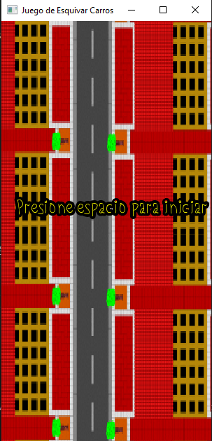
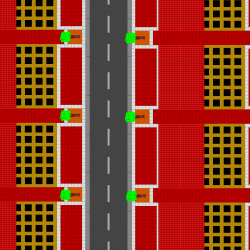

# Juego del Carro Loco



Un sencillo juego de conducción donde debes esquivar los carros que vienen en sentido contrario. Desarrollado usando SFML (Simple and Fast Multimedia Library).
El proyecto esta desarrollado sobre MinGW64 utilizando Msys2
y como editor se esta utilizando Visual Studio Code.


## Características

- Control de un carro que se mueve horizontalmente
- Dos tipos de carros obstáculos con diferentes velocidades
- Sistema de puntuación que aumenta con el tiempo
- Música de fondo para mayor inmersión
- Gráficos 2D con scroll infinito del fondo
- Pantallas de inicio y game over

## Prerequisitos

[Instalar las herramientas necesarias](./docs/herramientas.md)

[Instalar las Extensiones VSCode](./docs/extensiones.md)

[Instalar las librerias](./docs/librerias.md)

[Clonar el repositorio](./docs/fork.md)

## Requisitos del Sistema

- SFML 2.5 o superior
- Compilador C++ compatible (GCC, Clang, MSVC)
- Sistema operativo Windows, Linux o macOS

## Instalación

1. Clona el repositorio:
   ```bash
   git clone [enlace en línea](https://github.com/noemibriseno1/EjemplosJuego.git)
   cd juego-del-carro-loco
   

## Como ejecutar los ejemplos

Instalar todas las dependencias descritas arriba y dentro de una terminal de vscode ejecutar:

> make run'NombreEjecutable'

Por ejemplo para ejecutar '09_Proyecto.cpp' correr el comando en la terminal de vscode:

> make run09_Proyecto

## Controles

*Flecha izquierda: Mover carro a la izquierda

*Flecha derecha: Mover carro a la derecha

*Espacio: Iniciar/reiniciar juego

## Estructura de Archivos

juego-esquivar-carros/
├── assets/
│   ├── fonts/          # Fuentes del juego
│   ├── images/         # Sprites y fondos
│   └── music/          # Música y efectos de sonido
├── main.cpp            # Código fuente principal
└── README.md           # Este archivo

## Assets Necesarios

Para que el juego funcione correctamente, necesitas los siguientes archivos en sus respectivas carpetas:




## Lógica del Juego

-El jugador controla un carro que solo puede moverse horizontalmente

-Dos tipos de carros obstáculos aparecen desde arriba con velocidades aleatorias

-Cada obstáculo evitado suma 2 puntos al marcador

-La velocidad de los obstáculos aumenta gradualmente

-Colisionar con un obstáculo termina el juego

## Personalización

Puedes modificar estos parámetros en el código:

*Velocidad inicial de los obstáculos (líneas 45-46)

*Incremento de velocidad por punto (líneas 125 y 133)

*Posiciones permitidas en X (línea 53)

*Tamaño de los sprites (líneas 28, 36, 43)
