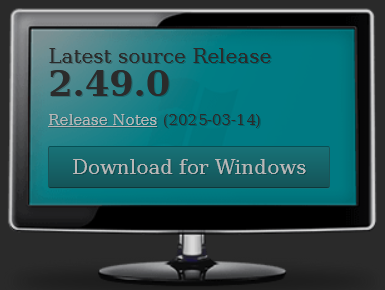
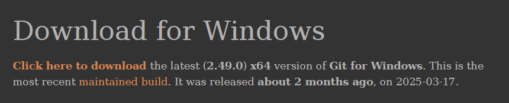

# Herramientas

### Visual estudio code
Descargar e instalar vscode en el siguiente [Enlace.](https://code.visualstudio.com/)

### MSYS2 (Windows)

Instalar Msys2 usando el siguiente [Enlace.](https://github.com/msys2/msys2-installer/releases/download/2025-02-21/msys2-x86_64-20250221.exe)

Instalar sin modificar ningua opcion solo dar click en siguiente hasta finalizar o podrian variar las configuraciones.

Agregar los siguientes directorios al path, darle en aceptar hasta cerrar todos los dialogos y reiniciar la maquina.

> C:\msys64\mingw64\bin

> C:\msys64\usr\bin

En caso de que no sepas como agregar los directorios al path sigue el siguiente tutorial
[(Tutorial) ¿Cómo agregar las variables de entorno?](./path.md)

### Github Desktop
Cliente de escritorio para clonar el repositorio, descargar usando el siguiente [enlace](https://desktop.github.com/).

### Git
Para poder realizar commits de vscode es necesario tener instalado Git, descargarlo del siguiente [enlace](https://git-scm.com/).

Seleccionar **Click here to download**

Instalar con las configuraciones por defecto, (Siguiente, siguiente, etc)

