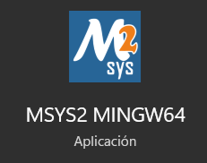
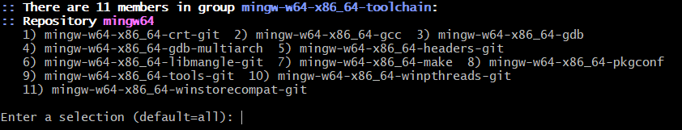

# Librerias utilizadas (Msys2)

Ejecutar los siguientes comandos en la terminal de msys2 para instalar las dependencias necesarias

Asegurarse que sea **MSYS2 MINGW64**
 

**Nota:** si por alguna razon alguno de los comandos falla, solamente repetir y se instalaran las librerias restantes.

### 1.- DevTools
Compiladores y herramientas necesarias para el desarrollo.

https://code.visualstudio.com/docs/cpp/config-mingw
> pacman -S --needed base-devel mingw-w64-x86_64-toolchain

Al momento que pregunte cuales paquetes se quieren installar solo dar **Enter**

### 2.- SFML
https://packages.msys2.org/package/mingw-w64-x86_64-sfml
> pacman -S mingw-w64-x86_64-sfml

### 3.- Box2D simulaciones de fisica - C++
https://box2d.org/documentation/
https://packages.msys2.org/package/mingw-w64-x86_64-box2d?repo=mingw64
> pacman -S mingw-w64-x86_64-box2d