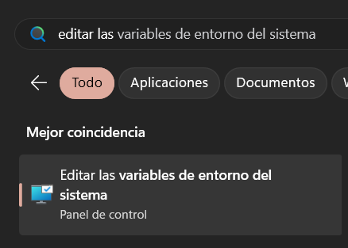
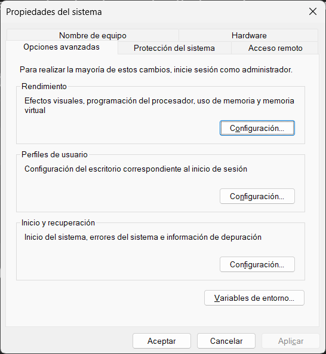
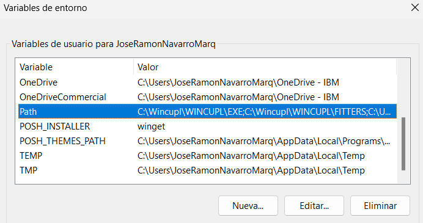
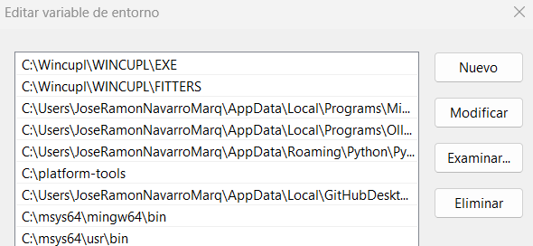

# Variables de entorno
Abrir el menu de inicio y buscar **Variables de entorno del sistema**
 

Dar click en Editar Variables de entorno
 

Buscar la variable de usuario PATH y abrirla
 

Agregar los siguientes registros y darle en aceptar hasta cerrar todos los dialogos:
> C:\msys64\mingw64\bin

> C:\msys64\usr\bin

Asi se debe de ver el resultado
 

